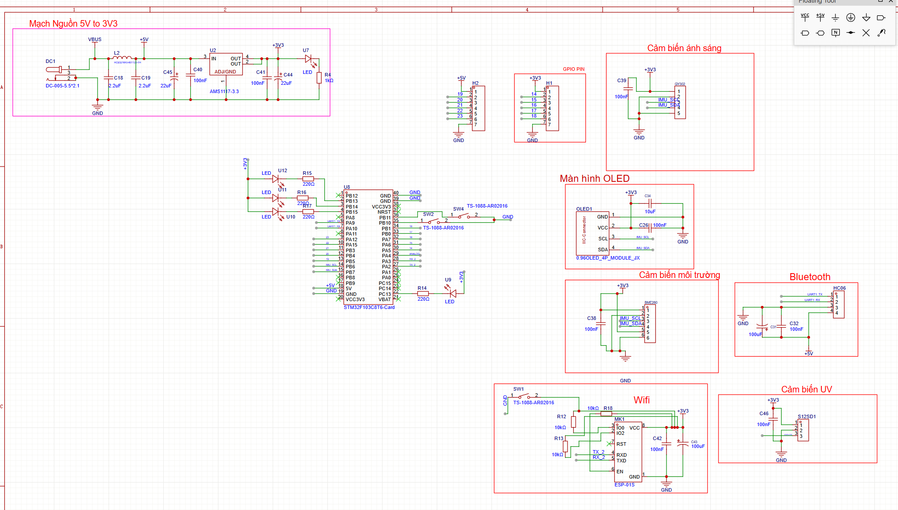
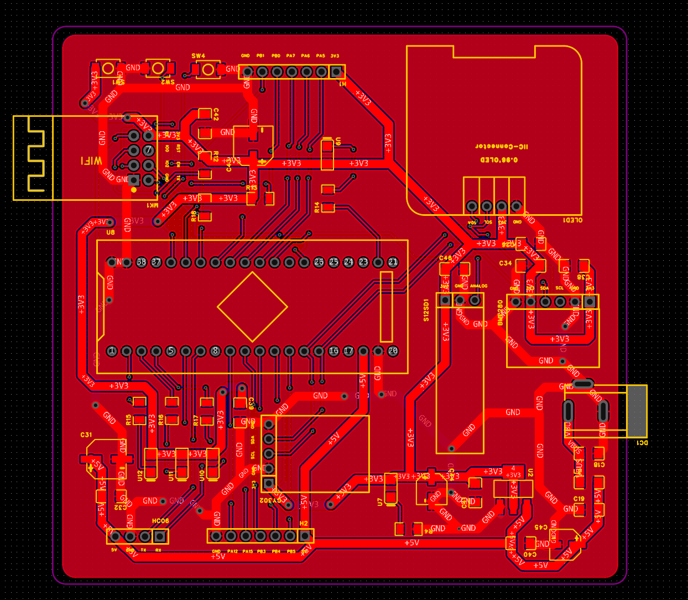
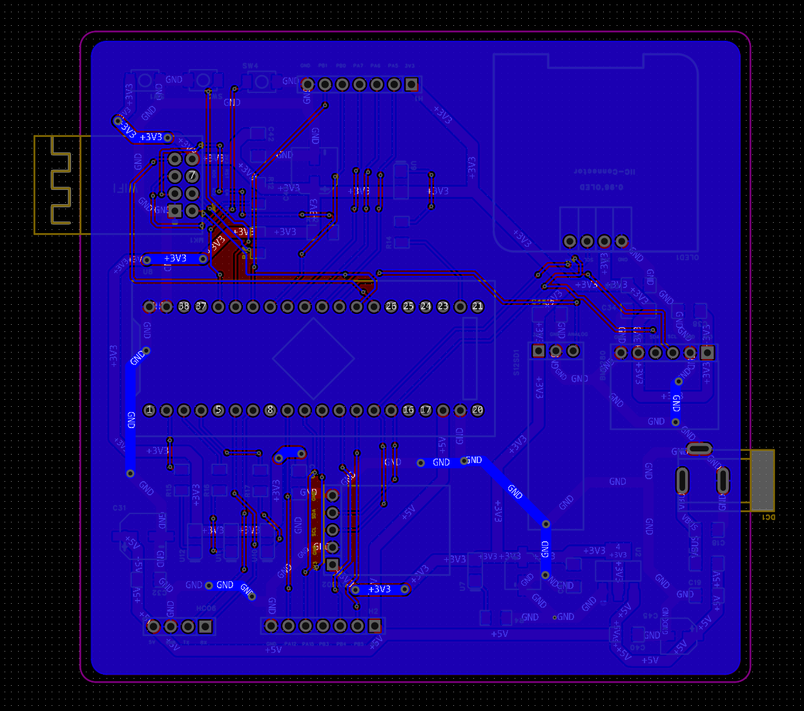
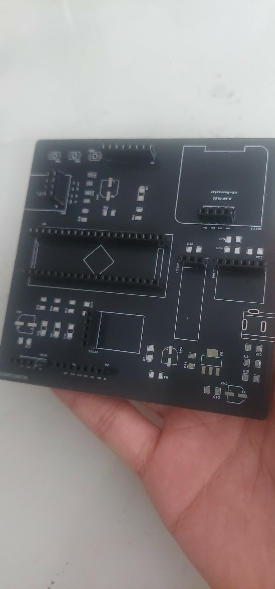
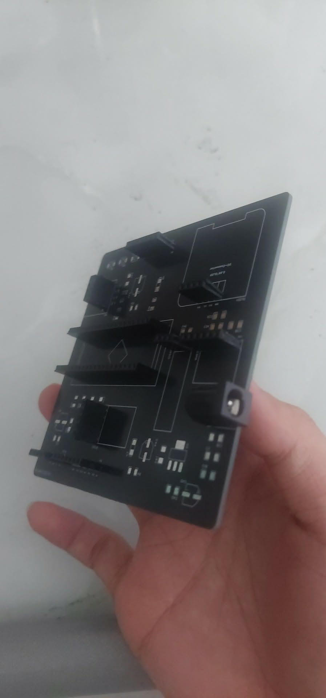
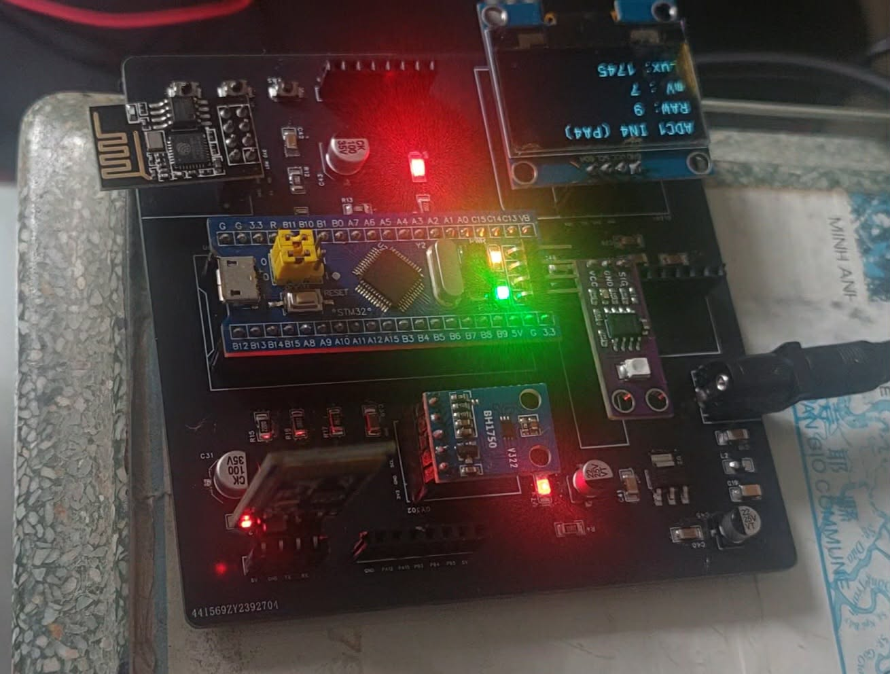

# STM32-WeatherStation-CustomPCB-GUI
Final project for Embedded Systems course: Features custom PCB design, STM32 micro-controller, and a dedicated GUI for weather monitoring.
step 1: PCB design with easy EDA pro

step2: Soldering

step3: Coding 